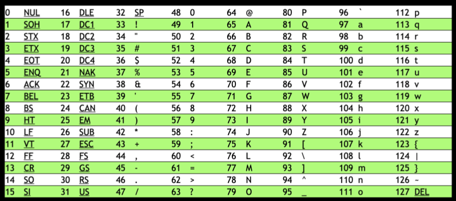

## Computer Science
Computer programming, outpu solution by input of problem and in between a program that convert it.

``input => [program] => output``
computer use binary system ``0 and 1``
millions and billions of tiny transistors being on (1) and off (0)
```example how computer counts
000 = 0
001 = 1
010 = 2
011 = 3
100 = 4
101 = 5
110 = 6
111 = 7
4th place 3th place 2nd place 1st place
uses base-2 to count
2^2 2^1 2^0
```
computer use 8-bits or 1-byte to represent number 00000000 = 0 and 11111111 = 255

## ASCII

letters are represented using 0 and 1
``A`` = 65 (01000001)
```
72 = H
73 = I
33 = !
```

## Unicode
are other special charecter and emoji that are use for communication

## Colors
Red, Green, Blue (RGB)
represent as intensity of this colors
```
r  g  b
72 73 33 gives light shade of yellow
```
image are the collection of RGB values
videos are collection of changing images

## Sound
represented with MIDI data

## Algorithms
```finding single name in phone book
step to fing the name = nth step (n)
1. single page at a time = n steps
2. two pages at a time = n/2 steps (with fix of some bug)
3. go to the middle of the phone book and ask, “Is the name I am looking for to the left or to the right?” Then, repeat this process, cutting the problem in half and half and half. = log2 n
```

this all are algorithms